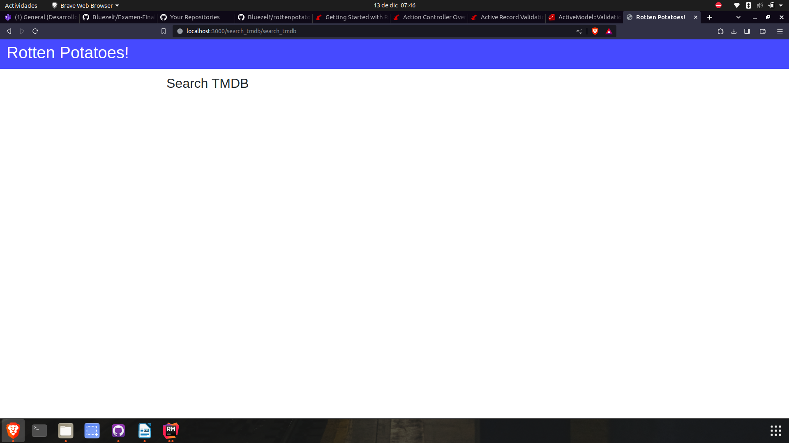
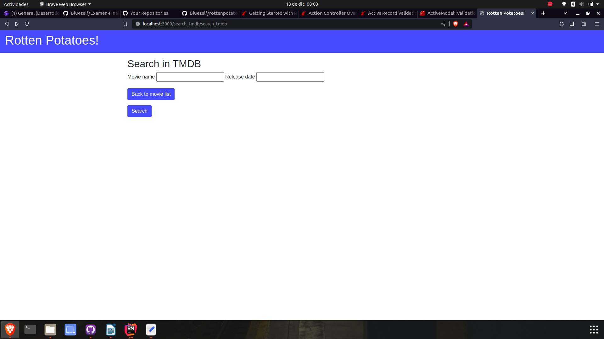

# Examen Final José Bustos

## Parte 1
1. Produce un conflicto de fusión (merge) 
ggyuydfghj
2. Modelo User de la siguiente manera
```ruby
class User < ActiveRecord::Base
  validates :username, :presence => true
  validate :username_format
end
```
- ¿Qué pasa si tenemos @user sin nombre de usuario y llamamos a @user.valid? ¿Qué guardará @user.save?
El método `valid` nos permite verificar si todas las validaciones predefinidas se cumplen o no, 
al ver que `@user` no tiene nombre nos dará una exepción, por la cual no se podrá guardar el user en la base
de datos.
- 


## Parte 2 - Pruebas
sdasadf
Se configura el proyecto con los pasos dados y se ve que funcione:

hjkl
Primero se crea el controlador con el comando `rails generate controller search_tmdb`, esto nos genera varias
carpetas, luego de eso creamos la vista `search_tmdb`, ademas de eso modificamos el archivos de `routes.rb`
```ruby
Rottenpotatoes::Application.routes.draw do
    resources :movies
    # map '/' to be a redirect to '/movies'
    root :to => redirect('/movies')
    get 'search_tmdb/search_tmdb'
end
```
Vemos si es que se puede acceder a la vista entrando a la ruta:

vemos que si se logra, luego de eso modificamos el contenido de la vista:
```erbruby
<h2>Search in TMDB</h2>
<%= form_tag movies_path, method: :post , id: :tmdb_form %>
<p>
  <%= label_tag :Movie_Name %>
  <%= text_field_tag :Movie_Name, params[:Movie_Name] %>
  <%= label_tag :Release_Date %>
  <%= text_field_tag :Release_Date, params[:Release_Date] %>
</p>
<p>
<%= link_to 'Back to movie list', movies_path, :class => 'btn btn-primary' %>
</p>
<p>
  <%= submit_tag "Search", :class => 'btn btn-primary' %>
</p>
```
En este caso usaremos el metodo `post` para enviar los datos,   para enviar los datos al formulario, creamos los labels necesarios para poder buscar la película con su nombre y release_date, asi tambien
creamos un boton para poder redirigirnos a la pagina de inicio, el boton back to movie_list es __funcional__

kkkkkkkkkkkkkkkkk
