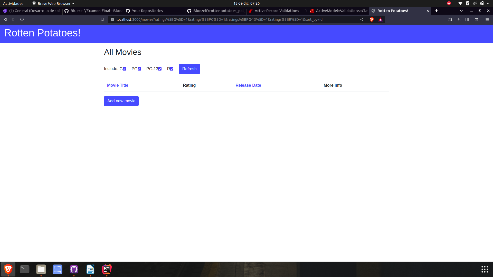

# Examen Final José Bustos

## Parte 1
1. Produce un conflicto de fusión (merge) 
Primero creemos una rama dentro de un repositorio existente elaborado en clase:
El repositorio será `Rails Avanzado`, lo que haremos será primero crear una rama llamada `conflicto` y luego
hjui.

Creamos la rama.

Ahora generaremos en conflicto solo cambiando la versión de ruby, la que se estaba usando en la actividad
es la version `3.0.2` y la vamos a cambiar a la `3.0.0`
2. Modelo User de la siguiente manera
```ruby
class User < ActiveRecord::Base
  validates :username, :presence => true
  validate :username_format
end
```
- ¿Qué pasa si tenemos @user sin nombre de usuario y llamamos a @user.valid? ¿Qué guardará @user.save?
El método `valid` nos permite verificar si todas las validaciones predefinidas se cumplen o no, 
al ver que `@user` no tiene nombre nos dará una exepción, por la cual no se podrá guardar el user en la base
de datos.

Y ahora la implementacion de `username_format`:
```ruby
def username_format
  if username.present? and not username.match(/^[a-z]+$/i)
    errors.add(:username, "El nombre solo debe contener letras")
  end
  if username.length < 1 && username.length > 10
    errors.add(:username, "EL nombre debe tener entre 1 y 10 caracteres")
  end
end
```
De esta manera validamos si el nombre solo debe contener letras y además que el nombre tenga entre 1 y 10 caracteres.

3. Admin Controller
Ahora para poder nosotros definir y redirigir a la pagina principal si es que el usuario no es admin usaremos
nuestro repositorio de `Rails Avanzado` y crearemos una clase controladora llamada `admin_controller.rb` y dentro
de ella ponemos lo siguiente:
```ruby
class AdminController < ApplicationController
  before_filter :check_admin
  def check_admin
    if !current_user.admin?
      redirect_to movies_path
      flash[:alert] = "acceso restringido"
    end
  end
end
```
De esta manera si es que el usuario no es admin, lo redirigirá a la pagina principal y le mostrará un mensaje.

4. Hola Mundo


5. ¿Cuándo deberías utilizar la metaprogramación basada en eval en lugar de la metaprogramación basada en bloques?.
   La principal diferencia es que la metaprogramación basada en eval se usa cuando se quiere ejecutar una cadena de texto
   como si fuera código de ruby, en cambio la metaprogramación basada en bloques se utiliza cuando se quiere ejecutar
   un bloque de código, entonces depende de las necesidades que se tenga se utilizará una u otra.
   Tenemos el siguiente ejemplo:
```ruby
def saludar
  yield
end
saludar { puts "hola mundo soy josé bustos y estoy en mi examen final de desarrollo de software" }
```
El codigo ejecuta el bloque que esta dentro de la función saludar.

## Parte 2 - Pruebas
sdasadf
Se configura el proyecto con los pasos dados y se ve que funcione:

hjkl
Primero se crea el controlador con el comando `rails generate controller search_tmdb`, esto nos genera varias
carpetas, luego de eso creamos la vista `search_tmdb`, ademas de eso modificamos el archivos de `routes.rb`
```ruby
Rottenpotatoes::Application.routes.draw do
    resources :movies
    # map '/' to be a redirect to '/movies'
    root :to => redirect('/movies')
    get 'search_tmdb/search_tmdb'
end
```
Vemos si es que se puede acceder a la vista entrando a la ruta:

vemos que si se logra, luego de eso modificamos el contenido de la vista:
```erbruby
<h2>Search in TMDB</h2>
<%= form_tag movies_path, method: :post , id: :tmdb_form %>
<p>
  <%= label_tag :Movie_Name %>
  <%= text_field_tag :Movie_Name, params[:Movie_Name] %>
  <%= label_tag :Release_Date %>
  <%= text_field_tag :Release_Date, params[:Release_Date] %>
</p>
<p>
<%= link_to 'Back to movie list', movies_path, :class => 'btn btn-primary' %>
</p>
<p>
  <%= submit_tag "Search", :class => 'btn btn-primary' %>
</p>
```
En este caso usaremos el metodo `post` para enviar los datos,   para enviar los datos al formulario, creamos los labels necesarios para poder buscar la película con su nombre y release_date, asi tambien
creamos un boton para poder redirigirnos a la pagina de inicio, el boton back to movie_list es __funcional__

kkkkkkkkkkkkkkkkk
